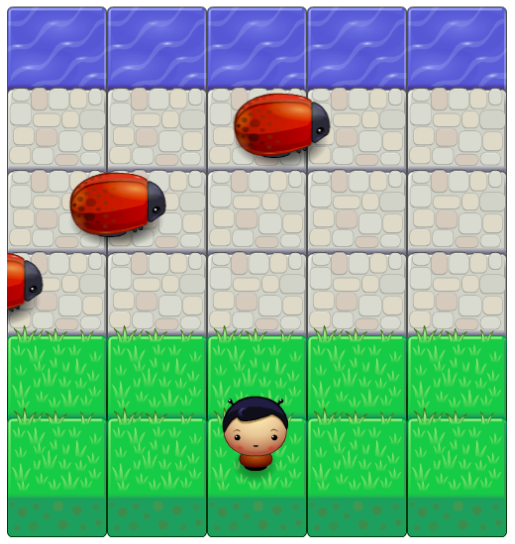

# Classic Arcade Game

This is the third project of the Udacity's Nanodegree Front-End Developer.

## Table of Contents

* [Challenge](#challenge)
* [How to play](#how-to-play)
* [Built with](#built-with)
* [Acknowledgment](#acknowledgment)

## Challenge

The goal of the game is to reach the water without any collision with enemies (bugs).

## How to play

- Player can move to the right, left, up and down by pressing appropriate keys (left, right, up and down)
- Using keys the player should avoid bugs
- If the player collides with an enemy, the game starts again
- If the player reaches the water on the other side, the player wins.

## Built with

The starter code and assets were already provided by the Udacity. The task for students was to add JavaScript. The game was built with the following languages and resources:

- HTML
- CSS
- JavaScript

## Acknowledgment

- Udacity community & mentors
